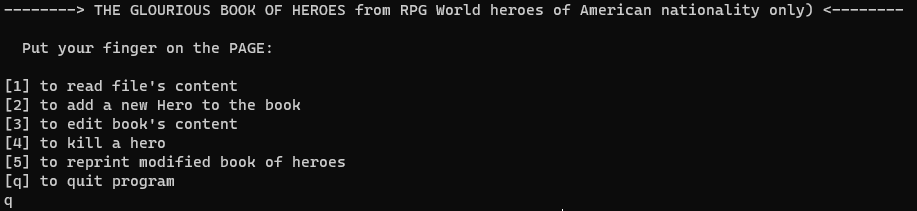

## Book of heroes, my 1st ever C++ program
This was my project for Fundamentals of Programming classes. The course took place in 2017/18. It took me 3 weeks to finish it. It's always tough at the beginning. Althought it's far from perfect i am still sentimental about it!

To run my program in a container just use the following command:
```bash
./script.sh
```
 This program offers multiple jaw-dropping features:
- Adding new hero to the "book-of-heroes"
- Modifying existing information about heroes
- Loading external text file to the program and creating instances of a class from it.
- Exiting program with grace!
- User input validation.
  
  ## Screenshot

